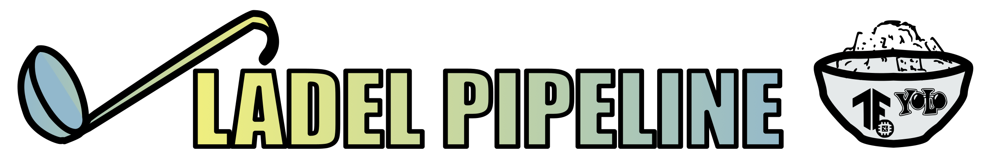

# Ladel Pipeline



Ladel is a TFLite labeling and training pipeline built for [FIRST Tech Challenge](<https://www.firstinspires.org/robotics/ftc>).

Ladel is a misspell of ladle which is also a misspell of label. To scoop data!

## Note

Most files have a `--help` option for options. Others will simply have information within the file.

## Installation

```bash
git clone https://github.com/apolunar/ladel
cd ladel
pip install -r requirements.txt
conda create -n 3.10 python=3.10
conda activate 3.10
```

## Labeling

`python ladel.py`


### Labeling keys

- 'a' key goes back a frame
- 'd' key goes forward a frame
- 'p' key pauses or plays the video
- 'i' key adds new bounding boxes
- 's' key deletes all bounding boxes
- 'q' to close **important** otherwise csv will not save properly
- 'lmb' left mouse deletes a specific bounding box clicked within
- You can purge all the files on each run
- You can start from the last frame saved on each run (to use more than one video)
- Input labels in the console (cannot be a number because of the way tfrecords work)

Tracks your initial box as you play the video, requiring a fraction of the work of other labeling tools.

## Training

There is a `train.py` file, ignore it, it's probably outdated and not what you want.

**Important note:** for GPU training to work with an NVIDIA GPU you must follow the instructions on [Tensorflow's install page](https://www.tensorflow.org/install/pip)

## Other Files

- tryit.py
  - use the webcam to try out TFLite models (don't expect a decent FPS)

## Record network stream

[Use VLC](https://recorder.easeus.com/screen-recording-resource/record-streaming-video-with-vlc.html).

## Bugs

Use issues tab to report it!

## Contributing

[Fork it, change it, pull request](https://docs.github.com/en/pull-requests/collaborating-with-pull-requests/proposing-changes-to-your-work-with-pull-requests/creating-a-pull-request-from-a-fork). Or make a feature request in issues tab.

### Some potential areas for improvement

- [ ] Improved/advanced labeler
  - [ ] Frame skipping
  - [ ] Label selection with scroll wheel
  - [ ] Other ideas...
- [ ] Write additional help messages and documentation (where needed, such as ladel behavior)
- [ ] Better code, currently practicing the "whatever works" system
- [ ] Consolidate reused functions (like load labelmap)

For now this is firmly in the beta state, if you could call it that.

## License

GNU General Public License v3.0

---

[](https://github.com/apolunar/ladel/watchers)
[](https://github.com/PotentialEnergyRobotics/ladel/stargazers)
